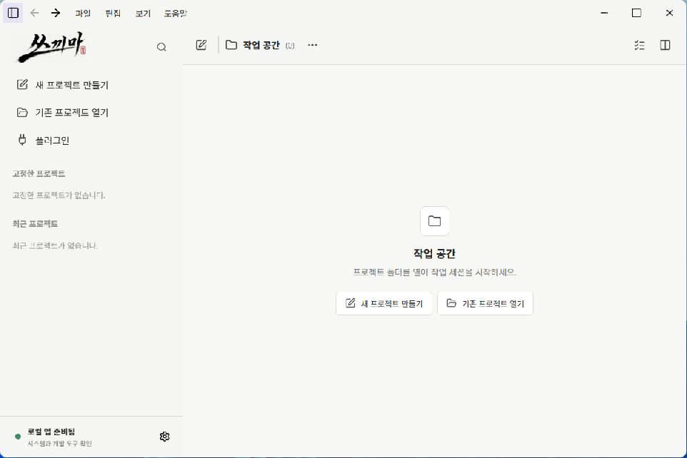

<div align="center">


# Skkima (쓰끼마)

**AI CLI 작업을 프로젝트에서 검증 가능한 결과까지 이어주는 Windows 데스크톱 작업 공간**

Codex · Claude Code · Antigravity의 작업 세션과 결과를 한곳에서 관리합니다.


</div>

---

## 제품 개요

<p align="center">
  
</p>

AI가 작업을 완료했다고 보고한 것만으로는 실제 결과를 판단하기 어렵습니다.
쓰끼마는 프로젝트, 작업 세션, 실행 기록과 산출물을 연결하여 **현재 상태와 다음 행동**을 확인할 수 있게 합니다.

```text
프로젝트 → 작업 세션 → AI CLI 실행 → 결과 검토
```

## 핵심 기능

| 영역 | 기능 |
|---|---|
| 작업 관리 | 프로젝트와 작업 세션을 분리하고 새 작업·이어가기·분기를 구분합니다. |
| 실행 연결 | Codex, Claude Code, Antigravity의 설치 상태와 실행 경로를 확인합니다. |
| 결과 검토 | 완료 상태, 검증 결과, 근거, 산출물과 다음 행동을 함께 확인합니다. |
| 확장 관리 | 로컬 파일과 GitHub 저장소의 스킬을 프로젝트별로 관리합니다. |

## 빠른 시작

> 공개 설치 파일과 재현 가능한 설치 절차는 첫 GitHub Release에서 제공합니다.

1. Windows 설치 파일을 실행합니다.
2. 기존 프로젝트를 열거나 새 프로젝트를 만듭니다.
3. AI CLI를 선택해 작업 세션을 시작합니다.
4. 실행이 끝나면 상태와 산출물을 검토합니다.

## 현재 범위

- **지원:** Windows 11, 개인 로컬 환경, Codex·Claude Code·Antigravity
- **지원:** 프로젝트별 작업 세션, 실행 기록, 결과 검토, 스킬 관리
- **아직 보장하지 않음:** 다중 사용자 협업, 다른 운영체제, 원격 데이터 동기화

## 더 알아보기

- [문서 안내](docs/README.md)
- [구조와 책임 경계](docs/architecture.md)
- [검증 원칙](docs/verification.md)

새 기능이 검증되면 README를 늘리는 대신 관련 문서를 이 구조에 추가합니다.

## 기술 구성

`Tauri 2` · `Rust` · `HTML/CSS/JavaScript` · `Python` · `JSON/JSONL`

## License

MIT License
