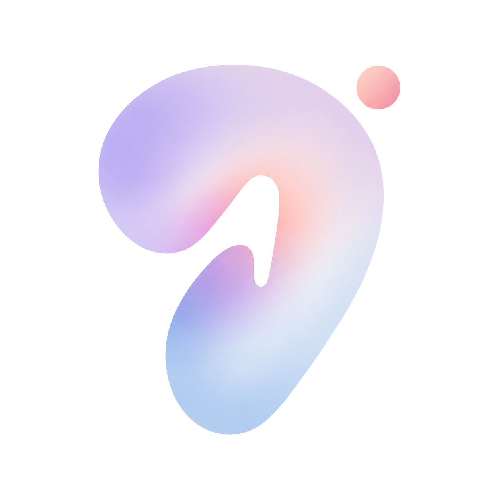
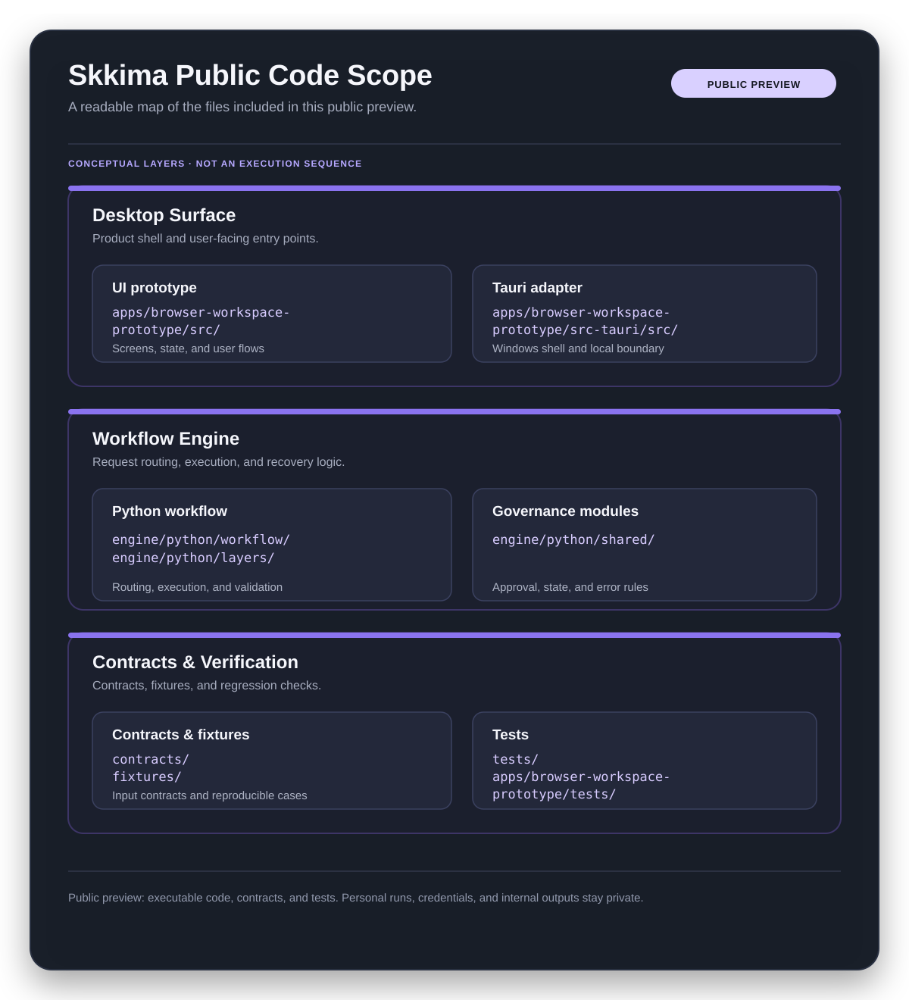

<div align="center">
  
  <h1>쓰끼마 (Skkima)</h1>
  <p><strong>A local workspace for turning ambiguous requests into traceable, AI-assisted workflows.</strong><br />
  Clarify the request, identify where human review is needed, use AI tools, and keep the context,<br />
  evidence, results, and recovery path connected.</p>
  <p>
    
    
    
    
  </p>
</div>

쓰끼마는 모호한 요청을 실행 가능한 작업 흐름으로 정리하는 Windows 데스크톱 워크스페이스입니다. 프로젝트와 작업 세션을 분리하고, AI 작업에 필요한 맥락·근거·사람의 검토와 승인·결과·복구 정보를 하나의 흐름으로 연결합니다.

## 왜 Skkima를 만들었나요?

저는 AI를 사용하면서 제가 원하는 결과를 얻기 위해 여러 방법을 직접 시도했습니다. 프롬프트를 계속 수정했고, GitHub에 공개된 스킬과 MCP를 찾아 실제 작업에 적용했습니다. 같은 요청이라도 어떤 맥락을 제공하고 어떤 도구를 연결하는지에 따라 결과가 달라졌기 때문입니다.

하지만 실제 업무나 특정 분야의 문제를 해결할 때는 프롬프트와 도구만으로 충분하지 않았습니다. 문제의 목적과 범위가 처음부터 명확하지 않은 경우가 많았습니다. 무엇을 해결해야 하는지, 어떤 정보가 필요한지, 결과를 어떤 기준으로 판단해야 하는지도 먼저 정리해야 했습니다.

이 경험을 통해 저는 더 나은 프롬프트를 만드는 것만큼 문제 상황을 구조화하는 일이 중요하다는 것을 알게 되었습니다. AI가 맡을 작업과 사람이 직접 검토하고 승인할 지점을 구분해야 했습니다. 이 구분은 단순한 기능 설계를 넘어 실제 업무 흐름과 연결되어 있었습니다.

결국 AI를 잘 활용하려면 도구를 선택하는 것만으로는 부족했습니다. 업무의 흐름과 판단 과정을 함께 설계해야 했습니다.

<sub>브라우저에서 데모 영상을 재생할 수 있습니다.</sub>

https://github.com/user-attachments/assets/7ab19579-ec6e-4515-b074-34241dc02a90

## 공개된 코드 범위



<br />
<br />

| 영역 | 경로 | 확인할 내용 |
|---|---|---|
| 데스크톱 UI | [`apps/browser-workspace-prototype/src/`](apps/browser-workspace-prototype/src/) | 프로젝트·세션·Run 상태 화면 |
| Tauri 어댑터 | [`apps/browser-workspace-prototype/src-tauri/src/`](apps/browser-workspace-prototype/src-tauri/src/) | Windows 프로세스·파일·권한 경계 |
| Python 엔진 | [`engine/python/workflow/`](engine/python/workflow/) | CLI 진입점과 Run 실행 |
| 워크플로 계층 | [`engine/python/layers/`](engine/python/layers/) | 입력 구조화·라우팅·검증·보고 |
| 거버넌스 모듈 | [`engine/python/shared/`](engine/python/shared/) | Run·artifact·continuation 계약 |
| 계약·샘플 | [`contracts/`](contracts/) · [`fixtures/`](fixtures/) | 스키마와 재현 가능한 테스트 입력 |
| 검증 | [`tests/`](tests/) · [`apps/browser-workspace-prototype/tests/`](apps/browser-workspace-prototype/tests/) | 회귀·거버넌스·UI 테스트 |

## 로컬 실행

```powershell
cd apps\browser-workspace-prototype
npm ci
npm test
npm run dev
```

포트폴리오용 Windows 설치 파일은 다음 명령으로 빌드합니다.

```powershell
npm run build:portfolio
```

Python 엔진의 CLI 도움말은 저장소 루트에서 확인할 수 있습니다.

```powershell
python .\engine\python\workflow\workflow_runner.py --help
```

## Portfolio Preview 범위

- Windows 11 x64 기준
- 외부 AI CLI가 없어도 UI와 샘플 코드·테스트를 확인할 수 있음
- 실제 사용자 Run, 개인 경로, 자격 증명, 내부 실험 산출물은 포함하지 않음
- Codex·Claude Code·Antigravity 연결은 설치된 환경에서 선택적으로 사용
- 운영 버전과 포트폴리오 데이터 경로는 분리

설치 파일은 소스 저장소가 아닌 GitHub Release Asset으로 배포하며, 제품의 전체 개발
저장소와 내부 검증 자료는 별도 개발 저장소에서 관리합니다.

## 구조 안내

```text
apps/       Windows desktop app
engine/     Python workflow engine
agents/     Agent operating contract and integration boundaries
contracts/  JSON schemas
fixtures/   Synthetic test inputs
tests/      Regression and contract tests
docs/       Product explanation and portfolio notes
```
