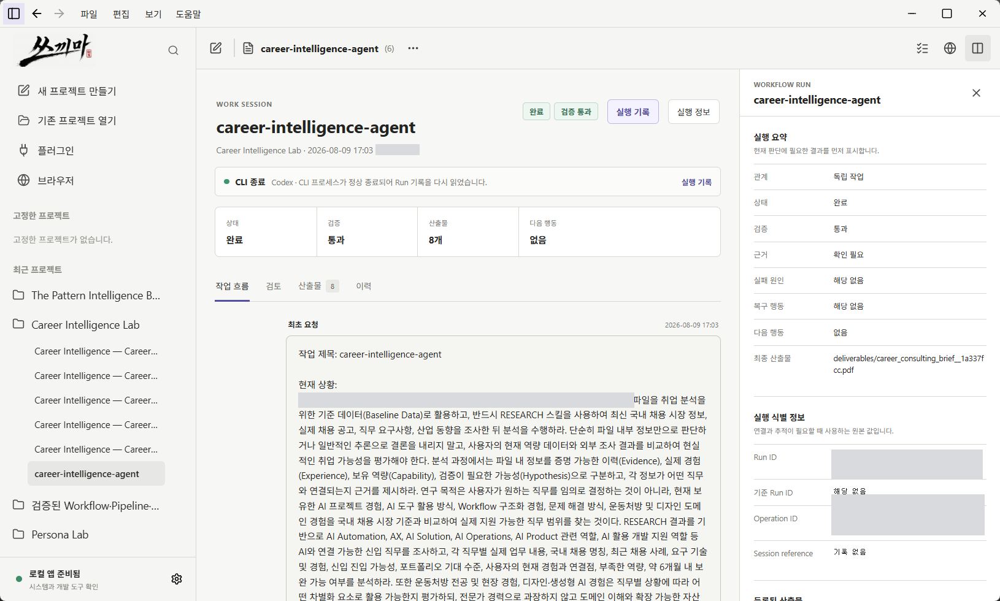
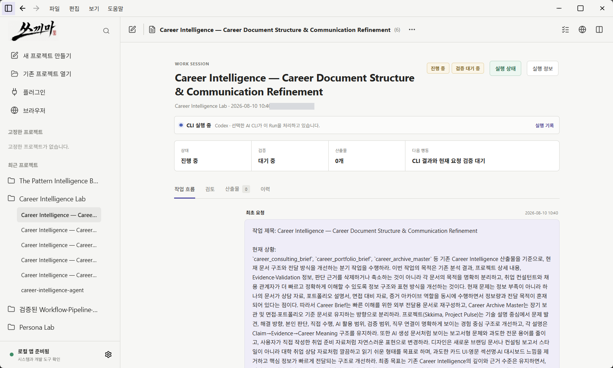
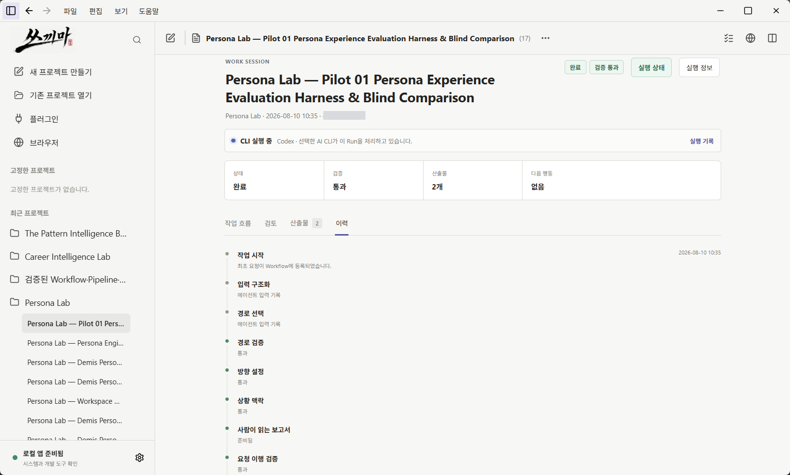
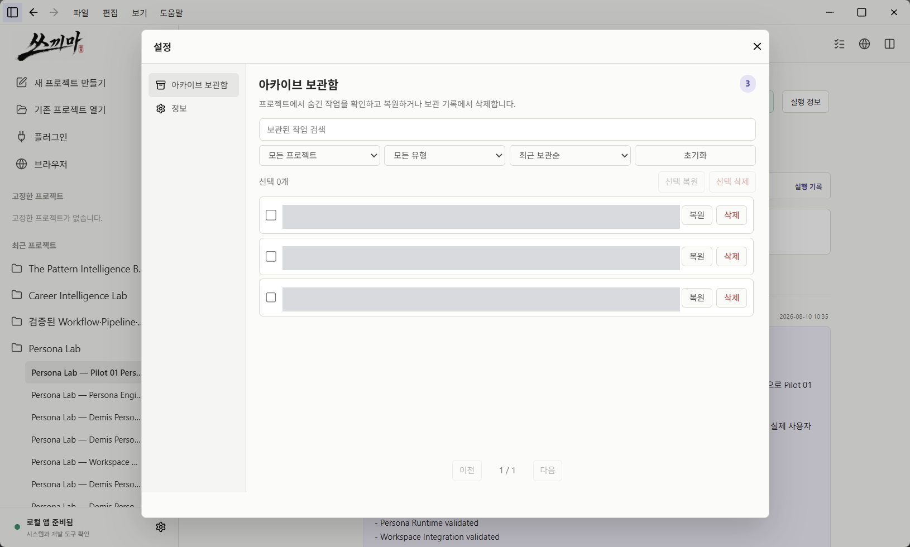
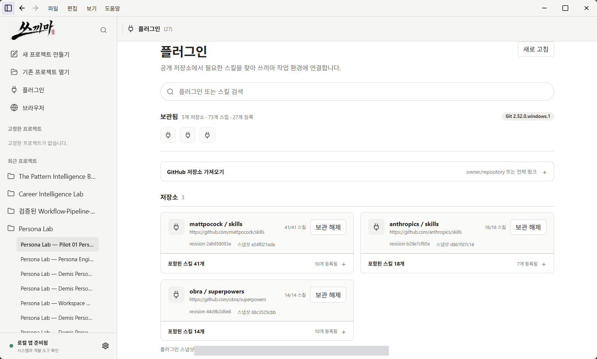

# Skkima (쓰끼마)

> AI 작업의 요청·Run·검증·산출물·다음 행동을 연결해, 사람이 현재 상태와 근거를 확인할 수 있게 만든 Windows 데스크톱 작업 공간

<p align="center">
  
  &nbsp;&nbsp;
  
</p>

<p align="center"><sub>목적: 흩어진 AI CLI 작업을 단순한 완료 보고가 아니라 추적 가능한 Workflow 기록으로 관리합니다.</sub></p>

<p align="center">
  <a href="assets/screenshots/portfolio-workflow-session-public.png">
    
  </a>
</p>

<p align="center"><sub>완료·검증·산출물·다음 행동과 실행 상세를 함께 보여주는 실제 작업 화면 · 1630×980 공개용 사본을 약 2× 픽셀 밀도로 표시 · 클릭하면 전체 크기로 열립니다.</sub></p>

## Problem — 무엇을 해결하려 했나

AI CLI 작업이 여러 프로젝트와 터미널에 흩어지면 “작업이 끝났다”는 보고와 실제 산출물·검증 결과가 쉽게 분리됩니다. 어떤 요청에서 시작했는지, 어느 Run이 어떤 결과를 만들었는지, 근거가 충분한지, 사람이 다음에 무엇을 해야 하는지 다시 찾기 어려워집니다.

Skkima는 이 문제를 **요청 → 실행 관계 → 상태 → 검증 → 산출물 → 다음 행동**의 구조로 나누어, 결과만이 아니라 판단 가능한 작업 맥락을 남기는 데 초점을 맞췄습니다.

## Approach — 어떤 판단으로 설계했나

1. **작업을 추적 가능한 단위로 분리했습니다.** 프로젝트, 작업 세션, Workflow Run, 산출물과 근거를 서로 연결합니다.
2. **완료와 검증을 구분했습니다.** CLI의 완료 보고, Workflow 검증 결과, 사람의 후속 검토를 같은 의미로 취급하지 않습니다.
3. **실행 전후의 경계를 명확히 했습니다.** 준비된 Run과 실행 도구를 확인한 뒤 사용자가 승인하고, 종료 후에는 상태·산출물·다음 행동을 검토합니다.
4. **복구 가능한 기록을 우선했습니다.** 실패·중단·분기 상태를 지우지 않고 남겨 작업을 다시 찾고 이어갈 수 있게 설계했습니다.

이 접근은 문제 구조화, Workflow 설계, QA 관점, 문서화, 상태 및 결과 추적 역량을 하나의 사용 흐름으로 보여주기 위한 선택입니다.

## Key Features — 핵심 기능

| 기능 | 사용자가 확인하는 것 | 설계 의도 |
|---|---|---|
| 프로젝트·작업 세션 관리 | 새 작업, 이어가기, 분기와 기준 Run | 작업의 출발점과 관계를 잃지 않음 |
| 실행 준비와 승인 | 실행 플랫폼, 작업 관계, 준비 상태 | 자동 실행 전에 사람이 경계와 대상을 확인 |
| 상태·검증·산출물 요약 | 실행 상태, 검증 결과, 등록 산출물, 다음 행동 | 완료 문구보다 검토 가능한 결과를 우선 |
| 중단·복구 흐름 | 중단 기록, aborted 상태, 재시작 가능 여부 | 실패와 중단을 삭제하지 않고 후속 행동으로 연결 |
| 스킬·플러그인 연결 | 로컬 스킬과 GitHub 저장소 기반 확장 기능 | 프로젝트별 도구 구성을 한곳에서 확인 |
| 리서치 Preflight | 출처 경로·해시·근거 수와 변경 여부 | 근거가 부족하거나 달라진 상태에서 실행되는 것을 방지 |

## Screenshots — 판단과 운영 흐름

대표 화면만 반복하지 않고, 서로 다른 실무 역량을 보여주는 실제 화면 네 장을 2×2로 구성했습니다. 각 이미지는 전체 크기보다 작게 표시해 글자 선명도를 유지하며, 클릭하면 1630×980 공개용 사본으로 열립니다.

<table>
  <tr>
    <td width="50%" valign="top">
      <a href="assets/screenshots/portfolio-workflow-running-public.png"></a><br>
      <strong>실행 상태 관리</strong><br>
      <sub>진행 중·검증 대기·산출물·다음 행동을 분리해 현재 상태를 오해하지 않게 합니다.</sub>
    </td>
    <td width="50%" valign="top">
      <a href="assets/screenshots/portfolio-workflow-history-public.png"></a><br>
      <strong>Workflow 이력 추적</strong><br>
      <sub>입력 구조화, 관계 선택, 검증, 산출물 등록, fulfillment의 처리 순서를 확인합니다.</sub>
    </td>
  </tr>
  <tr>
    <td width="50%" valign="top">
      <a href="assets/screenshots/portfolio-archive-recovery-public.png"></a><br>
      <strong>보관과 복구</strong><br>
      <sub>종료된 작업을 지우지 않고 보관하며, 필요한 기록은 다시 복원할 수 있습니다.</sub>
    </td>
    <td width="50%" valign="top">
      <a href="assets/screenshots/portfolio-plugin-library-public.png"></a><br>
      <strong>플러그인과 스킬 관리</strong><br>
      <sub>로컬 파일과 공개 저장소 기반 확장 기능을 구분하고 프로젝트별 설치 상태를 확인합니다.</sub>
    </td>
  </tr>
</table>

위 화면은 실제 작업 캡처의 공개용 사본입니다. Workflow 상태와 문제 해결 맥락은 유지하고, 로컬 절대 경로·실행 식별자·무관한 비공개 작업명만 불투명 마스크로 제거했습니다. 원본 해상도는 유지했습니다.

## Technical Overview — 기술과 구조

```text
사용자
  ↓ 프로젝트·세션 선택 / 실행 승인 / 결과 검토
Tauri 2 데스크톱 UI
  ↓ Windows 폴더·프로세스·로컬 상태 경계
Rust 계층
  ↓ 선택한 CLI 실행과 상태 기록
Codex · Claude Code · Antigravity
  ↓ 요청 구조화 / 관계 / 검증 / 산출물 등록
Python Workflow Engine
  ↓
프로젝트 내부 JSON·JSONL·문서 산출물
```

- **Desktop UI:** 프로젝트·세션·Run 탐색, 실행 준비, 결과 검토
- **Tauri/Rust:** Windows 로컬 접근, CLI 실행·중단·복구, 상태 저장 경계
- **Workflow Engine:** 요청 구조화, independent·continuation·branch 관계, fulfillment와 산출물 등록 검증
- **Local-first records:** 실제 프로젝트 폴더 안에 Run 기록과 산출물 경로를 보존

자세한 책임 분리는 [구조와 책임 경계](docs/architecture.md), 사용 흐름은 [Product Tour](docs/product-tour.md)에서 확인할 수 있습니다.

## Validation & Limitations — 확인된 범위와 한계

### 저장소에 기록된 검증 범위

| 항목 | 기록된 결과 |
|---|---|
| JavaScript 테스트 | 138건 통과 |
| Rust 테스트 | 91건 통과, 네트워크 의존 테스트 2건 제외 |
| 리서치 출처·Preflight 테스트 | 통과 |
| Rust 포맷 검사 | 통과 |
| Tauri 릴리스 빌드 | 통과 |
| Windows NSIS 패키지 | 통과 |
| 한국어 포함 Codex 프롬프트 | Windows 실행 경로 수정 후 재검증 필요 |

위 수치는 저장소의 [검증 문서](docs/verification.md)에 기록된 데스크톱 앱 0.1.6 기준입니다. 테스트 통과는 해당 계약과 환경에서 확인했다는 뜻이며 모든 Windows 환경이나 상용 운영 수준을 보장하지 않습니다.

### 현재 한계

- 개인 Windows 11 로컬 환경 중심의 포트폴리오 공개판입니다.
- Windows 이외 운영체제, 원격 동기화, 팀 권한 관리는 보장하지 않습니다.
- 브라우저 근거 기능은 사이트별 로그인과 구조 차이 때문에 제한된 검증 상태입니다.
- 실제 사용자 적용, 성능 개선 수치, 기업 운영 사례는 확인되지 않아 주장하지 않습니다.
- 공개 저장소에는 계정·비밀값과 내부 실험 설정을 포함하지 않습니다. 공개용 화면에서는 로컬 절대 경로·실행 식별자·무관한 비공개 작업명을 마스킹했습니다.

## Links — 관련 자료

- [GitHub Repository](https://github.com/LEESEOBAEK/Skkima)
- [문서 안내](docs/README.md)
- [구조와 책임 경계](docs/architecture.md)
- [사용 흐름](docs/product-tour.md)
- [검증 원칙과 결과](docs/verification.md)
- [문제 해결](docs/troubleshooting.md)
- Career Brief 공개 링크: `validation_needed`
- Portfolio Landing Page 공개 링크: `validation_needed`

---

**Tech:** Tauri 2 · Rust · HTML/CSS/JavaScript · Python · JSON/JSONL  
**Public scope:** Portfolio snapshot 0.1.6 · MIT License
