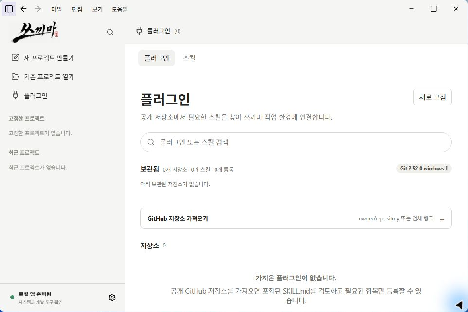

# Skkima (쓰끼마)

> AI CLI 작업을 프로젝트 단위로 관리하고, 실행 과정과 산출물을 검증 가능한 결과로 연결하는 Windows 데스크톱 포트폴리오 프로젝트

  

  

프로젝트·작업 세션·AI CLI 실행·검토 결과를 한 흐름으로 관리하는 로컬 우선 데스크톱 앱

## 한눈에 보기

| 항목 | 내용 |
|---|---|
| 문제 | AI CLI 작업이 여러 프로젝트와 터미널에 흩어져 상태·결과·복구 지점을 놓치기 쉬움 |
| 해결 | 프로젝트, 작업 세션, Workflow Run, 산출물과 검증 결과를 연결해 표시 |
| 대상 환경 | Windows 11 개인 로컬 환경 |
| 기술 | Tauri 2, Rust, JavaScript, Python Workflow Engine, JSON/JSONL |
| 공개 버전 | 포트폴리오 스냅샷 0.1.5 |
| 공개 범위 | 검증된 화면·설계·테스트 결과 중심. 실제 운영 데이터는 제외 |

## 프로젝트 소개

쓰끼마는 완성된 상용 제품을 공개하기 위한 저장소가 아니라, AI CLI를 활용한 작업을 프로젝트 단위로 관리하고 그 과정과 결과를 설명할 수 있게 만든 Windows 데스크톱 포트폴리오 프로젝트다.

AI가 작업을 완료했다고 보고하는 것과 실제 산출물이 생성되었는지, 검증되었는지, 사람이 다음에 무엇을 해야 하는지는 서로 다른 정보다. 쓰끼마는 이 차이를 프로젝트·작업 세션·Workflow Run·산출물·근거의 관계로 나누어 보여준다.

## 핵심 흐름

~~~text
프로젝트 폴더 열기
  → 새 작업·이어가기·분기 선택
  → 준비된 Workflow Run 확인
  → Codex·Claude Code·Antigravity 중 실행 환경 선택
  → 별도 CLI 창에서 작업 수행
  → Run 상태·검증·산출물·다음 행동 확인
  → 완료·실패·중단·복구 기록 보존
~~~

## 대표 화면

### 작업 공간

프로젝트를 열기 전의 기본 화면이다. 쓰끼마는 사용자 PC의 실제 프로젝트 폴더를 선택하는 방식으로 시작한다.

  

### 플러그인과 스킬 관리

로컬 스킬과 공개 저장소 기반 확장 기능을 한 화면에서 확인하고, 프로젝트별 설치 상태를 구분하는 화면이다.

  

## 포트폴리오에서 보여주는 기능

| 영역 | 공개 설명 | 상태 |
|---|---|---|
| 작업 관리 | 프로젝트와 작업 세션을 분리하고 새 작업·이어가기·분기를 구분 | 검증 완료 |
| 실행 연결 | Codex, Claude Code, Antigravity의 설치 상태와 실행 경계를 확인 | 검증 완료 |
| 실행 추적 | Run ID, 상태, 검증 결과, 다음 행동과 최종 산출물 표시 | 검증 완료 |
| 결과 검토 | 산출물·근거·검토 상태를 실행 기록과 연결 | 검증 완료 |
| CLI 복구 | 명시적 승인 후 중단하고 aborted 기록과 재시작 경로 보존 | 검증 완료 |
| 스킬·플러그인 | 로컬 파일과 GitHub 저장소에서 확장 기능을 선택적으로 등록 | 검증 완료 |
| 브라우저 근거 | 브라우저 페이지를 읽기 전용으로 진단하고 근거를 프로젝트에 기록 | 제한된 검증 |

## 시스템 구조

~~~text
사용자
  ↓
Tauri 데스크톱 UI
  ├─ 프로젝트·세션 탐색
  ├─ 실행 준비와 승인
  └─ 상태·근거·산출물 검토
       ↓
Tauri/Rust 경계
  ├─ Windows 폴더·프로세스 접근
  ├─ CLI 실행과 중단·복구
  └─ 로컬 상태 저장
       ↓
AI CLI + Python Workflow Engine
  ├─ Workflow Run과 실행 관계 생성
  ├─ 검증·fulfillment·산출물 등록
  └─ 프로젝트 내부 기록 보존
~~~

자세한 책임 분리는 [아키텍처 문서](docs/architecture.md)에서 설명한다.

## 실행 결과를 보는 기준

쓰끼마는 다음 네 가지를 한 화면에서 확인하는 것을 목표로 한다.

1. 현재 작업이 실행 중인지, 완료되었는지, 실패했는지
2. Workflow 검증이 통과했는지
3. 어떤 산출물이 등록되었는지
4. 사용자가 다음에 무엇을 해야 하는지

완료 보고만으로 최종 성공을 단정하지 않으며, 근거 부족·검토 필요·중단 상태는 별도 상태로 남긴다.

## 검증 결과

| 검증 항목 | 결과 |
|---|---|
| JavaScript 테스트 | 138건 통과 |
| Rust 테스트 | 91건 통과, 네트워크 의존 테스트 2건 제외 |
| Tauri 릴리스 빌드 | 성공 |
| Windows NSIS 설치 패키지 | 0.1.5 빌드 성공 |
| 주요 수동 흐름 | 프로젝트 선택, 작업 세션, CLI 실행, 복구 흐름 확인 |

테스트 범위와 제한사항은 [검증 문서](docs/verification.md)에서 확인할 수 있다.

## 공개 범위와 제한사항

이 저장소는 개인 로컬 환경에서 검증한 기능과 설계 결과를 선별한 포트폴리오 공개판이다. 상용 서비스나 다중 사용자 운영 제품으로 설명하지 않는다.

공개하지 않는 항목:

- 실제 사용자 작업 데이터와 실행 로그
- 개인 경로, 계정 정보, API 키와 로그인 정보
- node_modules와 Rust target
- 검증되지 않은 성능 수치
- 내부 운영 설정과 미완성 실험 코드

현재 보장하지 않는 항목:

- Windows 이외 운영체제
- 원격 데이터 동기화와 팀 권한 관리
- 모든 웹사이트에 대한 브라우저 자동화
- 무인 상태의 고위험 작업 실행

## 문서

- [문서 안내](docs/README.md)
- [구조와 책임 경계](docs/architecture.md)
- [사용 흐름](docs/product-tour.md)
- [스킬과 플러그인 관리](docs/skills-and-plugins.md)
- [검증 원칙과 결과](docs/verification.md)
- [문제 해결](docs/troubleshooting.md)
- [릴리스와 공개 범위](docs/release-guide.md)

## 기술 구성

Tauri 2 · Rust · HTML/CSS/JavaScript · Python · JSON/JSONL

## 향후 계획

1. 대표 기능 화면과 짧은 데모 영상 보완
2. 공개 저장소에서 기능별 증거 링크 연결
3. 제한된 브라우저 근거 기능의 추가 검증

## License

MIT License
