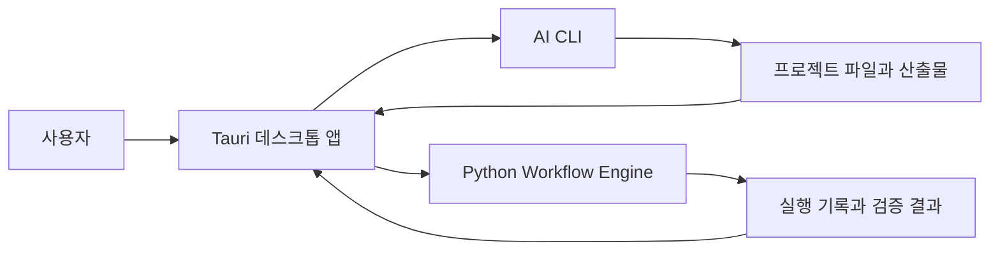

# 구조와 책임 경계

쓰끼마는 Windows 데스크톱 인터페이스와 Python 워크플로 엔진을 연결하되, 각 영역의 책임을 분리합니다.

## 주요 구성

| 구성 | 책임 |
|---|---|
| 데스크톱 UI | 프로젝트와 세션 탐색, 실행 준비, 결과 표시 |
| Tauri·Rust 계층 | Windows 기능, 로컬 파일 접근과 프로세스 실행 경계 |
| AI CLI | 사용자가 선택한 AI 작업 환경에서 실제 작업 수행 |
| Workflow Engine | 요청 구조, 실행 관계, 완료 조건과 산출물 등록 검증 |
| 프로젝트 데이터 | 실행 기록, 사용자 검토 상태와 산출물 경로 보존 |

## 설계 원칙

- 원본 실행 판정과 사용자 검토 상태를 분리합니다.
- 프로젝트 데이터는 기본적으로 사용자 PC에 보관합니다.
- AI CLI별 차이는 어댑터 경계에서 처리합니다.
- 공개 저장소와 설치 패키지에는 개인 작업 데이터를 포함하지 않습니다.
