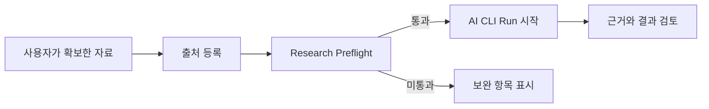

# 리서치 Run 신뢰성 개선 사례

> 공개 포트폴리오 기록 · 2026-08-06 · 검증한 앱 버전: 0.1.6

## 문제

리서치 작업에서 파일 경로가 없는 상태로 Run이 시작되거나, 비교 판단에 필요한
근거가 부족한 채 결과를 확정하려는 경우가 있었다. 이 상태에서는 실행이 실패한
뒤에야 원인을 알 수 있고, 결과를 다시 재현하기도 어렵다.

## 해결

쓰끼마는 자료를 직접 크롤링하는 도구가 아니라, 사용자가 이미 확보한 자료를
검증 가능한 Run으로 연결하는 데 초점을 맞췄다.

1. 로컬 파일, 공개 URL, 조사 메모를 출처로 등록한다.
2. 파일의 프로젝트 경계와 SHA-256을 확인하고, URL의 형식·자격 증명 포함 여부를 검사한다.
3. CLI 실행 전에 Research Preflight를 수행한다.
4. 사실 판단에는 추적 가능한 출처 1개 이상, 비교·권고·효과 판단에는 독립 출처 2개 이상을 요구한다.
5. 실패한 Run에는 원인, 보완할 검증 항목, 다음 행동과 재시도 경로를 남긴다.

## 확인한 시나리오

| 시나리오 | 기대 결과 | 확인 결과 |
|---|---|---|
| 존재하지 않는 로컬 파일 | CLI 시작 전 중단, 경로 보완 요청 | 확인 |
| 파일 내용 변경 | 저장한 SHA-256과 불일치하면 중단 | 확인 |
| 비교 판단에 출처 1개만 연결 | 독립 출처 2개 요구 | 확인 |
| 한글 Run ID | 경로 탐색 문자가 아니면 허용 | 확인 |
| `..` 등 경로 탐색 Run ID | 등록·실행 거부 | 확인 |

JavaScript 입력 검증 테스트, Rust 출처 검증 테스트, Rust 정적 검사와 Windows 설치 패키지 빌드를 통과했다.

## 의도적으로 제외한 범위

- 웹 크롤링, 링크 탐색, 로그인, CAPTCHA 우회, 자동 다운로드
- 쿠키·토큰·비밀번호·개인 입력값 수집
- 원문 자동 추출·요약, 출처 신뢰도 자동 판정
- 사용자 명시 승인 없는 원문 삭제

이 경계는 자료 수집의 권한·저작권 문제를 분리하고, 등록된 근거와 실제 실행 결과를
명확히 추적하기 위한 선택이다.

## 공개 시 유의사항

이 사례는 시뮬레이션과 개발 환경에서 검증한 기능을 설명한다. 실제 사용자 리서치
데이터, 접근 토큰, 로컬 파일 경로, 실행 로그와 산출물은 공개 저장소에 포함하지 않는다.
